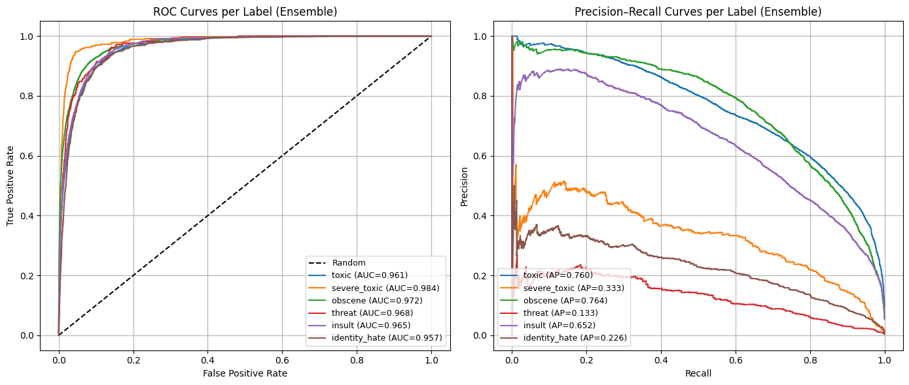

- $\textbf{Author}$: Patrick Mthisi
- $\textbf{Contact details}$: patrickmthisi@hotmail.com

# Toxic-Comments-Classification
## Project description
In this project, I built a multi-channel n-gram CNN for multi-label toxicity classification (six labels). The model uses pre-trained GloVe (100d) embeddings to initialize the embedding layer; embeddings are fine-tuned during training. GloVe leverages global co-occurrence statistics while producing embeddings similar in spirit to predictive approaches. Architecturally, the network runs parallel Conv1D branches with kernel sizes 3, 5, and 7 (capturing different n-gram patterns), applies max-pooling and flattening per branch, then concatenates the branch representations and outputs six sigmoid probabilities (one per label):

## Results and conclusion
Using a 5-model ensemble (mean of predicted probabilities), the model achieves strong discrimination across all labels.
Macro ROC AUC ≈ 0.968, with per-label ROC AUCs ranging from 0.957 to 0.984. For imbalanced labels, Precision–Recall is more informative: the ensemble obtains macro Average Precision (mAP) ≈ 0.478, with AP varying substantially by label (e.g., higher for toxic/obscene, lower for rare labels like threat). Overall, the model separates toxic vs non-toxic content well, and PR curves highlight the expected difficulty for rare classes:

